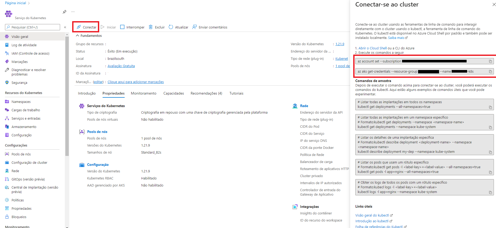

# Kubernetes com Flux CD

Instalação e configuração da automação de Deploy dos manifestos no k8s

Nesse passo a passo utilizamos o flux cli e kubectl para realizar a criação e monitoramento dos manifestos dentro do
cluster kubernetes.

1. [Configuração do ambiente (AZ / Kubectl / Flux)](#configuração-do-ambiente-az--kubectl--flux)
2. [Sincronização automática dos arquivos de manifestos](#sincronização-automática-dos-arquivos-de-manifestos)
3. [Automação para deploy de versão de containers](#automação-para-deploy-de-versão-de-containers)

## Configuração do ambiente (AZ / Kubectl / Flux)

1. [Instalação kubectl](https://kubernetes.io/docs/tasks/tools/#kubectl)
2. Conectar sua máquina local com a Azure e Cluster
    1. [Instalação do Azure CLI](https://docs.microsoft.com/pt-br/cli/azure/install-azure-cli?view=azure-cli-latest).

       Verifique a instalação com o comando abaixo, que deverá retornar a versão do CLI:
       > az version

    2. Realize o login no az:
       > az login
    3. Conecte seu az com o cluster k8s
        1. Acesse seu AKS dentro do [portal da Azure](https://portal.azure.com/)
        2. Clique em Conectar
        3. Execute os comandos que são mostrados no lado direito da tela:
           > az account set --subscription uuid-subscrição
           >
           > az aks get-credentials --resource-group Nome_Grupo_Recurso --name Nome_Cluster_k8s

           
        4. Verifique com o kubectl se está conectado com o cluster na azure com:
           > kubectl cluster-info
           >
           > Retorno:
           >
           >   Kubernetes control plane is running at https://
           >
           >   CoreDNS is running at https://
           >
           >   Metrics-server is running at https://
        5. Pronto, agora temos acesso ao cluster AKS, portanto **tome muito cuidado**.

4. [Instalação Flux CLI](https://fluxcd.io/docs/installation/#install-the-flux-cli)
    1. Verifique a instalação com:
       > flux -v

## Sincronização automática dos arquivos de manifestos

Agora com o ambiente configurado e conectado com o cluster, vamos realizar a configuração da sincronização do git para
deploy automático de manifestos.

Requisitos:

* kubectl acessando um cluster
* flux cli
* Repositório no github com os manifestos (arquivos yaml) do cluster como este de exemplo

**Atenção ao caminho das pastas/arquivos, pois dependo do S.O. utilizado pode ser necessário alterar as barras**

1. Abra um terminal e entre na pasta raiz do repositório git.
    * Caso não tenha crie uma pasta chamada flux-system
2. Inicie o flux com o comando:
   > ```shell
   > flux install --export ./flux-system/gotk-components.yaml
   > ```
   > Com isso será criado um arquivo gotk-components.yaml dentro da pasta flux-system, esse arquivo irá conter todos os recursos necessários para o flux realizar as operações.
3. Aplique a configuração do flux no cluster
   > ```shell 
   > kubectl apply -f ./flux-system/gotk-components.yaml
   > ```
   > Esse comando irá aplicar os recursos do flux que criamos no passo 2 dentro do cluster.
4. Cheque recursos do flux
   > ```shell
   > flux check
   > ```
   > Esse comando irá checar se todos os recursos do flux foram criados e se estão rodando corretamente no cluster.
5. Criar recurso do Git
   > ```shell
   > flux create source git <nome-git> \ 
   >    --git-implementation=libgit2 \ 
   >    --url=ssh://git@github.com/<caminho-repositorio> \ 
   >    --branch=main \ 
   >    --ssh-key-algorithm=rsa \ 
   >    --interval=1m
   > ```
   > Ao rodar esse comando, irá mostrar uma chave rsa de deploy no terminal. Essa chave deverá ser incluída no repositório github antes de prosseguir.
   >
   > 1. Acesse o repo
   > 2. Vá em Settings
   > 3. No módulo "Security", clique em Deploy Keys
   > 4. Adicione a key clicando em "Add deploy key" **Atenção: marcar a opção "Allow write access"**
   >
   > Após a criação da key, volte ao terminal e prossiga digitando "s" ou "y" e aguarde a finalização.
   >
   > Para verificar se o recurso foi criado rode o comando:
   > ```shell
   > kubectl get gitrepositories --all-namespaces
   > ```
   >
   > Esse recurso é responsável por manter o repositorio git sincronizado. A cada intervalo de tempo, informado no parametro interval, o recurso irá fazer sincronizar o repo (git pull).
6. Exportar recurso Git para arquivo yaml
   > Após a criação do recurso do Git, precisamos salvar as configurações em um manifesto yaml.
   >
   > Rode o comando:
   > ```shell
   > flux export source git <nome-aplicacao> > ./flux-system/gotk-sync.yaml
   > ```
   > Será criado um arquivo gotk-sync.yaml dentro da pasta flux-system

7. Criar recurso do kustomization
   > ```shell
   > flux create kustomization <nome-kustomization> \ 
   >    --source=<nome-git> \ 
   >    --path=./deploy/testing \ 
   >    --prune=true \ 
   >    --interval=1m
   > ```
   > **Você pode mudar o path de acordo com seu repositorio**
   >
   > Ao rodar esse comando, será criado o recurso Kustomization. Esse recurso é responsável por pegar os arquivos do repositorio dentro do path informado via parametro e fazer a aplicação dos manifestos dentro do cluster.
   >
   > Para verificar se o recurso foi criado rode o comando:
   > ```shell
   > kubectl get kustomization --all-namespaces
   > ```
8. Exportar recurso Kustomization para arquivo yaml
   > Após a criação do recurso do Kustomization, precisamos salvar as configurações em um manifesto yaml.
   >
   > Rode o comando:
   > ```shell
   > flux export kustomization <nome-aplicacao> >> ./flux-system/gotk-sync.yaml
   > ```
   > Será atualizado o arquivo gotk-sync.yaml dentro da pasta flux-system

Pronto, agora temos nosso cluster k8s sincronizado com o repositório git. Todos as alterações que são realizadas nos
manifestos que estão no git, serão sincronizados no cluster, de forma automática. 🤩🤩🤩

Caso você precise realizar alterações relacionadas aos recursos do Git ou Kustomization, você pode alterar o manifesto (
/flux-system/gotk-sync.yaml) e aplicar ele no cluster:

```shell
kubectl apply -f ./flux-system/gotk-sync.yaml
```

Com isso os recursos contidos nesse manifestos serão atualizados no cluster.

Para verificar se os recursos da aplicação estão rodando no cluster, rode os comandos normalmente de get, exemplo:

```shell
kubectl get pods --all-namespaces
```

Retornara todos os pods de todos os namespaces

Caso você queira ver os logs do flux, rode o comando abaixo:

```shell
flux logs --all-namespaces --since=2m
```

## Automação para deploy de versão de containers

Agora com o ambiente configurado, nosso cluster sincronizado com o git. Temos que realizar o deploy dos containers
automaticamente no cluster, respeitando as versões.

Requisitos

* kubectl acessando um cluster
* flux cli
* Repositório no github com os manifestos (arquivos yaml) do cluster, pode usar este repo como exemplo
* ACR configurado e com algum container
    * **Atenção: Caso o registry for privado é necessário criar um manifesto Secret para o k8s conseguir acessar os
      containers. Explico um pouco sobre isso no passo 2**

1. Instalando componentes no cluster
   > Rode o comando:
   > ```shell
   > flux install --components-extra=image-reflector-controller,image-automation-controller \ 
   >    --export > ./flux-system/gotk-components.yaml
   > 
   > Verifique se não quebrou nada:
   > 
   > flux check
   > ```
2. Acessando ACR com o k8s
   > Vamos criar um recurso no k8s chamado ImageRepository, esse recurso tem como função se conectar no acr e visualizar o container com suas versões.
   > 
   > **Segue um exemplo para o parametro image:** 
   >
   > meu-acr-registry.azurecr.io/meu-container
   > ```shell
   > flux create image repository <nome-do-repository> \
   >    --image=<url-do-acr-com-imagem> \
   >    --interval=1m \ 
   >    --namespace=<namespace-aplicacao> \
   >    --secret-ref=<nome-recurso-secret> \
   >    --export > ./deploy/testing/<nome-aplicacao>-testing-registry.yaml
   > ```
   > 
   > Ao executar esse comando, será criado o recurso e o manifesto. Porém temos que nos atentar a dois parametros: namespace e secret-ref.
   >
   > Esses parametros são muito importantes pois o recurso ImageRepository irá acessar o ACR e o ACR é privado e para acessar precisamos passar as credencias. 
   > Para isso utilizamos o parametro secret-ref e no valor colocamos o nome de um recurso Secret e para que tudo funcione e possamos separar nossos ambientes em namespaces, precisamos que o Secret e o ImageRepository estejam no mesmo namespace e por isso colocamos a tag namespace.
   > 
   > Resumindo, criamos o ImageRepository no mesmo namespace da nossa aplicação, assim podemos ter repositorys de diferentes namespaces, exemplo: dev, testing e production; E também, nesse namespace, precisamos ter um secret contendo as chaves de acesso ao ACR.
   > 
   > Para gerar o secret de uma forma fácil, podemos usar o kubectl:
   > ```shell
   > kubectl create secret docker-registry <NOME_DO_SEGREDO> \ 
   >    --docker-server <NOME_DO_REGISTRO>.azurecr.io \
   >    --docker-username=<USUARIO> \
   >    --docker-password=<SENHA> \
   >    --output=yaml
   > ```
   > Salve o yaml e crie um arquivo manifesto dentro da pasta de sua aplicação
   > 
   > O usuário e senha, você consegue acessando o ACR no portal azure:
   >    1. Acesse o registro de container
   >    2. No módulo de configurações, clique em "Chaves de Acesso"
   >    3. Marque a opção "Usuário administrador"
   >    4. Usuário é o campo: "Nome de usuário"
   >    5. Senha é o campo: "password"
   >
   > Agora com tudo criado e configurado, vamos checar se nosso ImageRepository está funcionando:
   > ```shell
   > flux get image repository --all-namespaces
   > ```
   > Esse comando deverá retornar o repository criado, com a mensagem: "successful scan, found X tags"

3. Criando politica de versionamento
   > Com o nosso ImageRepository criado e rodando, vamos criar o recurso chamado ImagePolicy. Esse recurso tem como função resgatar a "ultima imagem" do container. Não só a ultima, você pode configurar como bem entender.
   > 
   > ```shell
   > flux create image policy <nome-da-policy> \ 
   >    --image-ref=<nome-do-repository> \
   >    --select-alpha=asc \ 
   >    --filter-regex='^v(?P<ts>\d.\d.\d)-beta$' \ 
   >    --filter-extract='$ts' \ 
   >    --export > ./deploy/testing/meu-app-testing-policy.yaml
   > ```
   > 
   > Ao executar o comando, o flux irá criar a policy, vou explicar os parametros.
   > 
   > **image-ref** referencia para qual imagem essa policy será aplicada.
   >
   > **select-alpha** Diz como queremos que a policy se comporte com base na tag, no caso é ordem alfabética. Temos outras opções, você terá que ver qual mais se adequa, peguei de exemplo a mais complexa. Mas existem: --select-numeric --select-semver. Você pode consultar a documentação para entender mais: [ImagePolicy](https://fluxcd.io/docs/cmd/flux_create_image_policy/)
   >
   > **filter-regex** Montamos um regex para pegar apenas a versão da tag e jogar para uma váriavel de nome "ts". Caso sua tag seja diferente, deverá adapatar o regex ou utilizar um seletor que mais se adéque ao seu cenário.
   >
   > **filter-extract** Pegamos do regex a variavel "ts" e extraímos ela para o seletor fazer o a ordenação.
   >
   > Resumindo, temos várias imagens com diferentes versões, mas respeitando a nomenclatura: vX.X.X-beta. Nosso regex pega apenas os números da versão, no caso X.X.X e nosso extrator diz para o seletor que deve usar esse valor como parametro e pegar na ordem afabetica, do maior pro menor. Utilizamos alfabetica pois temos "." 1.0.0
   > 
   > Para verificar se tudo está certo e que a policy está pegando a versão correta, rodamos o comando:
   > ```shell
   > flux get image policy --all-namespaces
   > ```
   > 
   > Aqui você pode ficar testando qual a melhor forma para extrair a versão do container do seu jeito.

4. Atualizando manifestos com nova versão
   > Agora chegamos a última etapa de criação de recursos! Com o ImageRepository consultando nosso container e versões, nossa ImagePolicy resolvendo a última versão do container. Agora só precisamos atualizar os manifestos para pegarem sempre a versão correta do container. Para isso vamos criar o recurso ImageUpdateAutomation. Tem como função atualizar o arquivo de manifesto e subir a alteração no git com um commit baseado na ImagePolicy. Vamos lá!
   >
   > ```shell
   > flux create image update <nome-da-automacao> \ 
   >    --namespace=<namespace-aplicacao>
   >    --git-repo-ref=<nome-git> \ 
   >    --git-repo-namespace=flux-system \ 
   >    --git-repo-path="./deploy/testing" \ 
   >    --checkout-branch=main \ 
   >    --push-branch=main \ 
   >    --author-name=automation-fluxcdbot \ 
   >    --author-email=automation-fluxcdbot@botfluxcd.com.br \ 
   >    --commit-template="chore: update container version to {{range .Updated.Images}}{{println .}}{{end}}" \ 
   >    --export > ./deploy/testing/flux-system-automation.yaml
   > ```
   > 
   > Ao executar o comando, pronto temos a automação, o flux irá criar a ImageUpdateAutomation, porém ainda não vai funcionar pois precisamos criar um marcado, mas antes uma breve explicação de alguns parametros.
   >
   > **git-repo-ref** referencia para qual GitRepository essa automação irá se conectar.
   >
   > **git-repo-namespace** referencia qual name space nosso GitRepository está. Só uma observação, o GitRepository criamos na segunda etapa desse documento, porém não definimos um namespace e quando não define, o flux coloca como default o namespace flux-system e tudo bem ele ficar nesse namespace default, pois todos os outros namespaces vão utilizar esse GitRepository, de qualquer forma, você pode personalizar conforme seu cenário.
   >
   > **git-repo-path** referencia para qual pastas a automação vai realizar as alterações, ou seja, todos os arquivos manifestos nessa pasta a automação vai verificar e alterar conforme a policy.
   >
   > **checkout-branch** branch de checkout
   >
   > **push-branch** branch que será realizada o push.
   >
   > **commit-template** Aqui é interessante, podemos personalizar a mensagem de commit, caso você queira utilizar alguma convenção do seu projeto. No exemplo, coloquei seguindo a [Conventional Commits](https://www.conventionalcommits.org/en/v1.0.0/).

5. Colocando marcadores
   > Pronto, agora com tudo configurado e funcionando. Precisamos colocar um marcado em nossos manifestos que usam container. Assim o ImagePolicy consegue identificar qual container editar.
   > 
   > Para adicionar é bem simples, abra o manifesto que utiliza o container, por exemplo um Deployment e na linha que chama o container colocamos o marcador. Como no exemplo abaixo:
   > ```yaml
   > apiVersion: apps/v1
   > kind: Deployment
   > metadata:
   >  name: deployment-meu-app
   >  namespace: <namespace-aplicacao>
   > spec:
   >  replicas: 1
   >  selector:
   >  matchLabels:
   >    app: meu-app
   >  template:
   >    metadata:
   >      name: pod-meu-app
   >      labels:
   >        app: meu-app
   >    spec:
   >      containers:
   >        - name: docker-meu-app
   >          image: <NOME_DO_REGISTRO>.azurecr.io/<nome-do-container>:v1.0.2-beta # {"$imagepolicy": "<namespace-aplicacao>:<nome-da-policy>"}
   >          ports:
   >            - containerPort: 3000
   >      imagePullSecrets:
   >        - name: <NOME_DO_SEGREDO>
   > ```


